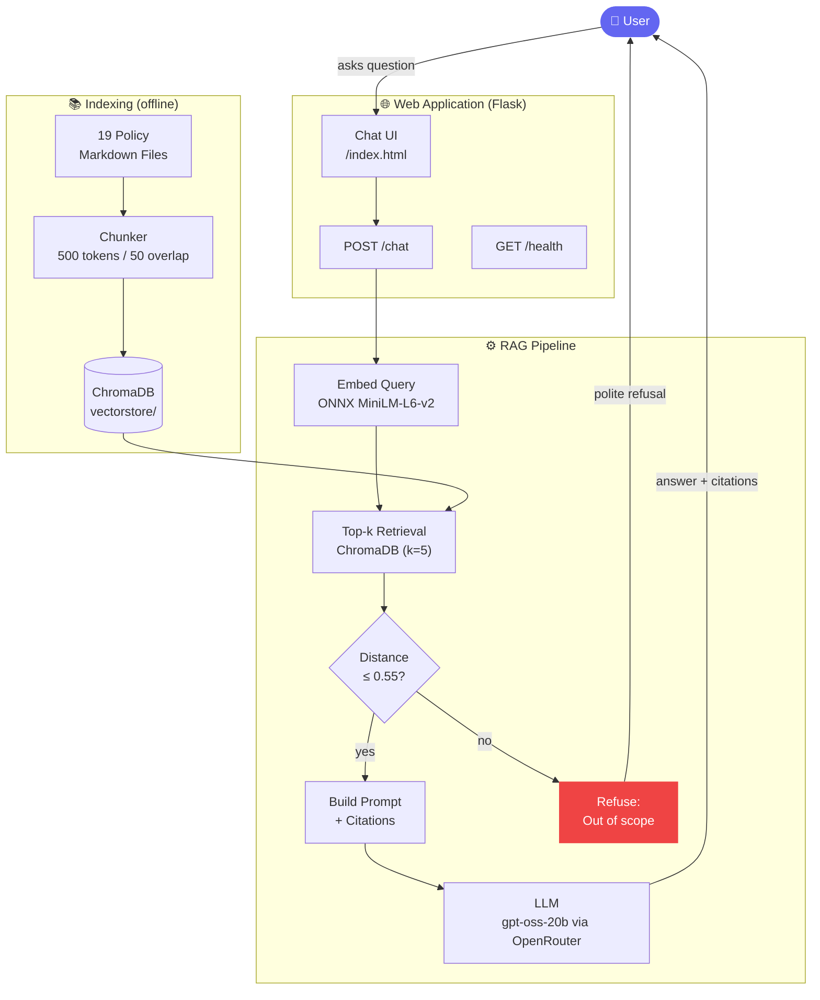

# RAG Policy Assistant

A Retrieval-Augmented Generation (RAG) application that answers questions about company policies and procedures for **Custom Kids Books**, a fictional personalized children's book company.

## Project Overview

This application uses RAG to provide accurate, citation-backed answers to questions about company policies. It retrieves relevant policy sections from a Chroma vector database and generates grounded responses using an LLM via OpenRouter.

## Architecture



## Features

- Document ingestion and indexing with sentence-transformer embeddings (`all-MiniLM-L6-v2`)
- Semantic search across 20 policy documents stored in ChromaDB
- LLM-powered answer generation with citations via OpenRouter free tier
- Web chat interface for interactive queries
- Guardrails to refuse out-of-scope questions (similarity threshold: 0.55)
- `/health` endpoint for monitoring
- CI/CD via GitHub Actions with automated tests and Render deployment

## Evaluation Results

| Metric | Score |
|---|---|
| Groundedness (avg) | **1.76 / 2.0** (88%) |
| Citation Accuracy (avg) | **1.56 / 2.0** (78%) |
| Out-of-scope Refusal | **2 / 2** (100%) |
| Latency p50 | **3,806 ms** |
| Latency p95 | **25,721 ms** |

## Setup Instructions

### Prerequisites

- Python 3.9 or higher
- An [OpenRouter](https://openrouter.ai) API key (free tier)

### Installation

1. Clone the repository:
```bash
git clone <repository-url>
cd rag-policy-assistant
```

2. Create and activate a virtual environment:
```bash
python -m venv venv
source venv/bin/activate  # On Windows: venv\Scripts\activate
```

3. Install dependencies:
```bash
pip install -r requirements.txt
```

4. Set up environment variables:
```bash
cp .env.example .env
# Edit .env and set OPENROUTER_API_KEY
```

### Running the Application

Start the Flask server:
```bash
python wsgi.py
```

The application will be available at `http://localhost:10000`

Alternatively, with gunicorn:
```bash
gunicorn wsgi:app --bind 0.0.0.0:10000
```

### Re-indexing Documents (optional)

The vector store is already pre-built and committed. To re-ingest:
```bash
python -m src.indexing.ingest
```

## API Endpoints

- `GET /` - Web chat interface
- `POST /chat` - Submit `{"question": "..."}` and receive `{"answer": "...", "citations": [], "latency_ms": ...}`
- `GET /health` - Health check (returns pipeline status)
- `POST /warmup` - Trigger background pipeline initialization

## Project Structure

```
rag-policy-assistant/
├── corpus/                  # 20 policy markdown documents
├── src/
│   ├── app/
│   │   ├── app.py           # Flask application
│   │   ├── templates/       # index.html chat UI
│   │   └── static/          # style.css, app.js
│   ├── indexing/
│   │   ├── doc_loader.py    # Markdown + YAML front matter parser
│   │   ├── section_splitter.py
│   │   ├── chunker.py       # Overlap chunking with SHA1 IDs
│   │   └── ingest.py        # Chroma ingestion pipeline
│   ├── retrieval/
│   │   ├── embedding_model.py
│   │   ├── vector_retriever.py
│   │   └── rag_retriever.py # Top-k + threshold guardrail
│   └── rag/
│       ├── rag_pipeline.py  # End-to-end RAG pipeline
│       └── chat.py          # CLI interface
├── vectorstore/             # Pre-built Chroma database
├── evaluation/
│   ├── questions.json       # 25 evaluation questions
│   ├── run_evaluation.py    # Evaluation runner
│   └── results/             # Saved results
├── tests/
│   ├── indexing/            # Unit tests: doc loading, chunking, splitting
│   ├── retrieval/           # Unit tests: retriever with fakes
│   ├── rag/                 # Unit tests: RAG pipeline with fakes
│   ├── integration/         # Integration tests: real vector store
│   └── app/                 # Smoke tests: Flask endpoints
├── .github/workflows/ci.yml # CI/CD pipeline
├── wsgi.py                  # WSGI entry point
├── requirements.txt
├── design-and-evaluation.md # Architecture + evaluation results
├── ai-tooling.md            # AI tools used
└── deployed.md              # Deployment URL
```

## Development

Run tests (43 tests total — unit, integration, and smoke):
```bash
pytest -v
```

Run the CLI:
```bash
python -m src.rag.chat
```

## Documentation

- [Design and Evaluation](design-and-evaluation.md) — Architecture decisions and evaluation results
- [AI Tooling](ai-tooling.md) — AI tools used in development
- [Deployment Info](deployed.md) — Live deployment URL

## License

MIT
